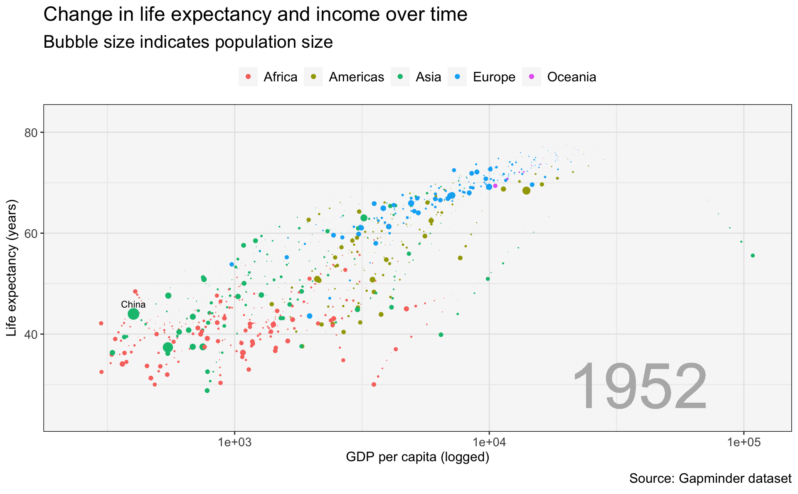

## Setup


::: {.cell}
::: {.cell-output .cell-output-stdout}

```
        country        continent        year         lifeExp     
 Afghanistan:  12   Africa  :624   Min.   :1952   Min.   :23.60  
 Albania    :  12   Americas:300   1st Qu.:1966   1st Qu.:48.20  
 Algeria    :  12   Asia    :396   Median :1980   Median :60.71  
 Angola     :  12   Europe  :360   Mean   :1980   Mean   :59.47  
 Argentina  :  12   Oceania : 24   3rd Qu.:1993   3rd Qu.:70.85  
 Australia  :  12                  Max.   :2007   Max.   :82.60  
 (Other)    :1632                                                
      pop              gdpPercap       
 Min.   :6.001e+04   Min.   :   241.2  
 1st Qu.:2.794e+06   1st Qu.:  1202.1  
 Median :7.024e+06   Median :  3531.8  
 Mean   :2.960e+07   Mean   :  7215.3  
 3rd Qu.:1.959e+07   3rd Qu.:  9325.5  
 Max.   :1.319e+09   Max.   :113523.1  
                                       
```


:::
:::


<center>

[](https://www.google.com/url?sa=i&url=https%3A%2F%2Fwww.gapminder.org%2Ftag%2Fgapminder-world%2F&psig=AOvVaw2IwfQSTFDghid4GnL0WUtb&ust=1721330817600000&source=images&cd=vfe&opi=89978449&ved=0CBQQjRxqFwoTCLjn9pPnrocDFQAAAAAdAAAAABAE)

</center>

## gganimate::

In this graphic, I want to spotlight China's development path, and also show the story of differences by continent. First, I'll show all the data, which makes clear the need for animation of this data.


::: {.cell layout-align="center"}

```{.r .cell-code}
gapminder %>% 
  ggplot(.,
         aes(x=gdpPercap,
             y=lifeExp,
             size=pop,
             color=continent)) +
  geom_point() + 
  geom_text(data=gapminder %>% filter(country == 'China'),
                           aes(label=country), 
                           family='Arial', size= 3, color='black', nudge_y = 2) + 
  scale_x_log10() + 
  ggtitle('Change in life expectancy and income over time',
          subtitle = 'Bubble size indicates population size') + 
  labs(x='GDP per capita (logged)\n',
       y='Life expectancy (years)',
       caption='Source: Gapminder dataset') + 
  theme(legend.position = 'top') + 
  guides(size='none')
```

::: {.cell-output-display}
{fig-align='center' width=960}
:::
:::


## gganimate::


::: {.cell layout-align="center"}

```{.r .cell-code}
gapminder %>% 
  ggplot(.,
         aes(x=gdpPercap,
             y=lifeExp,
             size=pop,
             color=continent)) +
  geom_point() + 
  geom_text(data=gapminder %>% filter(country == 'China'),
                           aes(label=country), 
                           family='Arial', size= 3, color='black', nudge_y = 2) + 
  geom_text(aes(x=min(gdpPercap), 
                y=min(lifeExp),
                label=as.factor(year)), 
            hjust=-1.5, vjust=-0.2, alpha=0.2, color='gray70', size=20) +
  scale_x_log10() + 
  ggtitle('Change in life expectancy and income over time',
          subtitle = 'Bubble size indicates population size') + 
  labs(x='GDP per capita (logged)\n',
       y='Life expectancy (years)',
       caption='Source: Gapminder dataset') + 
  theme(legend.position = 'top') + 
  guides(size='none') + 
  my.theme + 
  transition_states(
    year,
    transition_length = 2,
    state_length = 0,
    wrap = TRUE
  ) + 
  enter_fade() + 
  exit_shrink() +
  ease_aes()
```

::: {.cell-output-display}
{fig-align='center'}
:::
:::


## Using the gganimate::shadow_wake() function to leave a trail


::: {.cell layout-align="center"}

```{.r .cell-code}
gapminder %>% 
  ggplot(.,
         aes(x=gdpPercap,
             y=lifeExp,
             size=pop,
             color=continent)) +
  geom_point() + 
  geom_text(data=gapminder %>% filter(country == 'China'),
                           aes(label=country), 
                           family='Arial', size= 3, color='black', nudge_y = 2) + 
  geom_text(aes(x=min(gdpPercap), 
                y=min(lifeExp),
                label=as.factor(year)), 
            hjust=-2, vjust=-0.2, alpha=0.2, color='gray70', size=20) +
  scale_x_log10() + 
  ggtitle('Change in life expectancy and income over time',
          subtitle = 'Bubble size indicates population size') + 
  labs(x='GDP per capita (logged)\n',
       y='Life expectancy (years)',
       caption='Source: Gapminder dataset') + 
  theme(legend.position = 'top') + 
  guides(size='none') + 
  my.theme + 
  transition_states(
    year,
    transition_length = 2,
    state_length = 0,
    wrap = TRUE
  ) + 
  shadow_wake(wake_length = 0.1, alpha = FALSE, exclude_layer = c(2,3)) + 
  enter_fade() + 
  exit_shrink() +
  ease_aes()
```

::: {.cell-output-display}
{fig-align='center'}
:::
:::
