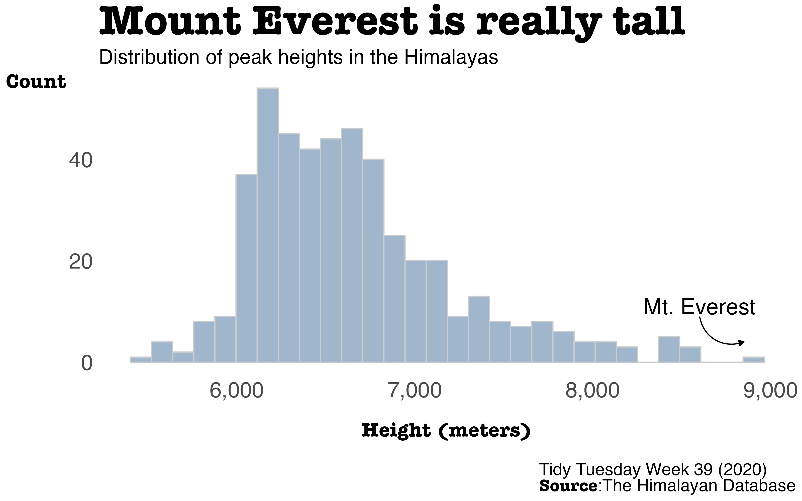
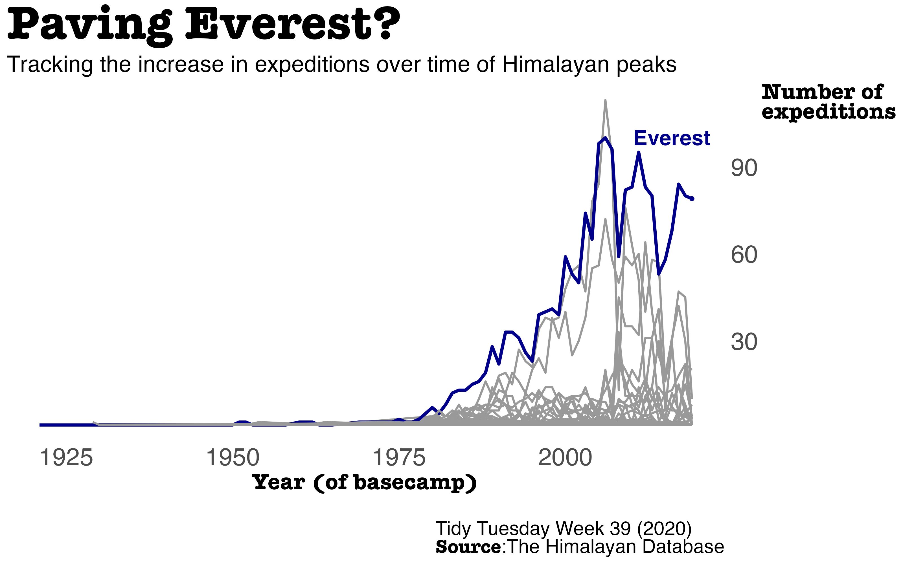

{#fig-1}

{#fig-2}

# 1. Load Packages & Setup


::: {.cell}

```{.r .cell-code}
if (!require("pacman")) install.packages("pacman")
pacman::p_load(
    tidyverse,
    tidytuesdayR,
    ggtext,
    showtext,
    janitor,   #for clean_names()
    scales,
    glue,
    here
)    

font_add_google("Open Sans")
```
:::


# 2. Read in the Data


::: {.cell}

```{.r .cell-code}
tt_year <- 2020
tt_week <- 39

tuesdata <- tidytuesdayR::tt_load(tt_year, week = tt_week)

peaks <- tuesdata$peaks
expeditions <- tuesdata$expeditions
```
:::


# 3. Examine the Data 


::: {.cell}

```{.r .cell-code}
peaks %>% 
  glimpse()
```

::: {.cell-output .cell-output-stdout}

```
Rows: 468
Columns: 8
$ peak_id                    <chr> "AMAD", "AMPG", "ANN1", "ANN2", "ANN3", "AN…
$ peak_name                  <chr> "Ama Dablam", "Amphu Gyabjen", "Annapurna I…
$ peak_alternative_name      <chr> "Amai Dablang", NA, NA, NA, NA, NA, NA, NA,…
$ height_metres              <dbl> 6814, 5630, 8091, 7937, 7555, 7525, 8026, 8…
$ climbing_status            <chr> "Climbed", "Climbed", "Climbed", "Climbed",…
$ first_ascent_year          <dbl> 1961, 1953, 1950, 1960, 1961, 1955, 1974, 1…
$ first_ascent_country       <chr> "New Zealand, USA, UK", "UK", "France", "UK…
$ first_ascent_expedition_id <chr> "AMAD61101", "AMPG53101", "ANN150101", "ANN…
```


:::

```{.r .cell-code}
expeditions %>% 
  glimpse()
```

::: {.cell-output .cell-output-stdout}

```
Rows: 10,364
Columns: 16
$ expedition_id      <chr> "ANN260101", "ANN269301", "ANN273101", "ANN278301",…
$ peak_id            <chr> "ANN2", "ANN2", "ANN2", "ANN2", "ANN2", "ANN2", "AN…
$ peak_name          <chr> "Annapurna II", "Annapurna II", "Annapurna II", "An…
$ year               <dbl> 1960, 1969, 1973, 1978, 1979, 1980, 1980, 1981, 198…
$ season             <chr> "Spring", "Autumn", "Spring", "Autumn", "Autumn", "…
$ basecamp_date      <date> 1960-03-15, 1969-09-25, 1973-03-16, 1978-09-08, NA…
$ highpoint_date     <date> 1960-05-17, 1969-10-22, 1973-05-06, 1978-10-02, 19…
$ termination_date   <date> NA, 1969-10-26, NA, 1978-10-05, 1979-10-20, 1980-0…
$ termination_reason <chr> "Success (main peak)", "Success (main peak)", "Succ…
$ highpoint_metres   <dbl> 7937, 7937, 7937, 7000, 7160, 7000, 7250, 6400, 740…
$ members            <dbl> 10, 10, 6, 2, 3, 6, 7, 19, 9, 5, 5, 5, 6, 4, 3, 4, …
$ member_deaths      <dbl> 0, 0, 0, 0, 0, 1, 0, 0, 1, 0, 1, 0, 0, 0, 0, 0, 0, …
$ hired_staff        <dbl> 9, 0, 8, 0, 0, 2, 2, 0, 3, 0, 0, 3, 4, 2, 0, 2, 5, …
$ hired_staff_deaths <dbl> 0, 0, 0, 0, 0, 0, 0, 0, 0, 0, 0, 0, 0, 0, 0, 0, 0, …
$ oxygen_used        <lgl> TRUE, FALSE, FALSE, FALSE, FALSE, FALSE, FALSE, FAL…
$ trekking_agency    <chr> NA, NA, NA, NA, NA, NA, NA, NA, NA, NA, NA, "Kunga"…
```


:::
:::


# 4. Tidy the Data 


::: {.cell}

```{.r .cell-code}
expedition_attempts <- peaks %>% 
  select(peak_id, height_metres) %>% 
  left_join(x=.,
            y=expeditions,
            by='peak_id') %>% 
  mutate(basecamp_year = year(basecamp_date)) %>% 
  group_by(peak_name, basecamp_year) %>% 
  summarise(count_expeditions = n(),
            .groups = 'drop') %>% 
  mutate(is_everest = if_else(peak_name == 'Everest',
                              'Everest', 'Other'))
```
:::


# 5. Visualization Parameters 


::: {.cell}

```{.r .cell-code}
my_theme <- theme(
  # choose font family
  text = element_text(family = 'Open Sans', size=14), 
  axis.ticks = element_blank(), 
  plot.background = element_rect(fill = "white", colour = NA),
  panel.background =  element_rect(fill = "white", colour = NA), 
  legend.position = 'none',
  panel.grid.major = element_blank(),
  panel.grid.minor = element_blank(),
  panel.border = element_blank())

arw <- arrow(length = unit(5, "pt"), type = "closed")
```
:::


# 6. Plot 

#### Histogram 


::: {.cell}

```{.r .cell-code}
peak_hist_viz <- peaks %>% 
  ggplot(.) + 
  geom_histogram(aes(x=height_metres),
                 fill='slategray3',
                 color='gray80',
                 bins=30) + 
  geom_curve(data = data.frame(), 
             aes(x = 8600, y = 9, xend = 8850, yend = 4), 
             color = 'black', arrow = arw) +
  annotate("text", x=8600, y=11, label = 'Mt. Everest', family='Open Sans', size=7) + 
  ggtitle('Mount Everest is really tall..',
          subtitle = 'Distribution of peak heights in the Himalayas') + 
  labs(x='<br>Height (meters)',
       y='Count',
       caption='<br>Tidy Tuesday Week 39 (2020)<br>**Source**:The Himalayan Database') + 
  scale_x_continuous(labels = comma) + 
  my_theme + 
  theme(plot.title = element_textbox(size=rel(2.7), face='bold'),
        plot.subtitle = element_text(size=rel(1.3)),
        plot.caption = element_textbox(size=rel(1.1), lineheight = .3),
        axis.title.y = element_textbox(hjust = 1, size=rel(1.3), face='bold'),
        axis.title.x = element_textbox(size=rel(1.3), face='bold'),
        axis.text = element_text(size=rel(1.4)))
```
:::


#### Line plot 


::: {.cell}

```{.r .cell-code}
paving_everest_viz <- expedition_attempts %>%
  ungroup() %>% 
  filter(complete.cases(.)) %>% 
  ggplot(.,
         aes(x=basecamp_year,
             y=count_expeditions,
             color=is_everest,
             size=is_everest)) + 
  geom_line(aes(group=peak_name)) + 
  geom_point(data=. %>% filter(basecamp_year == 2019,
                               peak_name == 'Everest')) + 
  annotate(geom = "text", x=2016, y=100,
           label='Everest',
           color='darkblue',
           size=6,
           fontface='bold') + 
  ggtitle('Paving Everest?',
          subtitle = 'Tracking the increase in expeditions over time of Himalayan peaks') + 
  labs(x='Year (of basecamp)<br>',
       y='Number of<br>expeditions',
       caption='Tidy Tuesday Week 39 (2020)<br>**Source**:The Himalayan Database') + 
  scale_size_manual(values = c('Everest' = 1.2,
                               'Other' = .8)) + 
  scale_color_manual(values = c('Everest' = 'darkblue',
                                'Other' = 'gray60')) + 
  scale_y_continuous(position = 'right',
                     breaks = seq(0, 90, by=30),  
                     labels = c('', '30', '60', '90')) + 
  my_theme + 
  theme(plot.title = element_textbox(size=rel(2.7), face='bold'),
        plot.subtitle = element_text(size=rel(1.3)),
        plot.caption = element_textbox(size=rel(1.1), lineheight = .3),
        axis.title.y = element_textbox(size=rel(1.3), face='bold', lineheight = .3),
        axis.title.x = element_textbox(size=rel(1.3), face='bold'),
        axis.text = element_text(size=rel(1.4)))
```
:::


# 7. Save 


::: {.cell}

```{.r .cell-code}
# Save the plot as PNG
ggsave(
  filename = glue("tt_{tt_year}_{tt_week}_hist.png"),
  plot = peak_hist_viz,
  width = 10, height = 6.25, units = "in", dpi = 320
)

ggsave(
  filename = glue("tt_{tt_year}_{tt_week}_line.png"),
  plot = paving_everest_viz,
  width = 10, height = 6.25, units = "in", dpi = 320
)

# make thumbnail for page
magick::image_read(glue("tt_{tt_year}_{tt_week}_hist.png")) %>%
  magick::image_resize(geometry = "400") %>%
  magick::image_write(glue("tt_{tt_year}_{tt_week}_hist_thumbnail.png"))

magick::image_read(glue("tt_{tt_year}_{tt_week}_line.png")) %>%
  magick::image_resize(geometry = "400") %>%
  magick::image_write(glue("tt_{tt_year}_{tt_week}_line_thumbnail.png"))
```
:::


# 8. Session Info

::: {.callout-tip collapse="true"}
##### Expand for Session Info


::: {.cell}
::: {.cell-output .cell-output-stdout}

```
R version 4.4.0 (2024-04-24)
Platform: aarch64-apple-darwin20
Running under: macOS Sonoma 14.6.1

Matrix products: default
BLAS:   /Library/Frameworks/R.framework/Versions/4.4-arm64/Resources/lib/libRblas.0.dylib 
LAPACK: /Library/Frameworks/R.framework/Versions/4.4-arm64/Resources/lib/libRlapack.dylib;  LAPACK version 3.12.0

locale:
[1] en_US.UTF-8/en_US.UTF-8/en_US.UTF-8/C/en_US.UTF-8/en_US.UTF-8

time zone: America/Denver
tzcode source: internal

attached base packages:
[1] stats     graphics  grDevices utils     datasets  methods   base     

other attached packages:
 [1] here_1.0.1         glue_1.8.0         scales_1.3.0       janitor_2.2.0     
 [5] showtext_0.9-7     showtextdb_3.0     sysfonts_0.8.9     ggtext_0.1.2      
 [9] tidytuesdayR_1.1.2 lubridate_1.9.3    forcats_1.0.0      stringr_1.5.1     
[13] dplyr_1.1.4        purrr_1.0.2        readr_2.1.5        tidyr_1.3.1       
[17] tibble_3.2.1       ggplot2_3.5.1      tidyverse_2.0.0    pacman_0.5.1      

loaded via a namespace (and not attached):
 [1] gtable_0.3.5      xfun_0.48         httr2_1.0.5       htmlwidgets_1.6.4
 [5] gh_1.4.1          tzdb_0.4.0        vctrs_0.6.5       tools_4.4.0      
 [9] generics_0.1.3    curl_5.2.3        parallel_4.4.0    fansi_1.0.6      
[13] pkgconfig_2.0.3   lifecycle_1.0.4   farver_2.1.2      compiler_4.4.0   
[17] textshaping_0.4.0 munsell_0.5.1     snakecase_0.11.1  htmltools_0.5.8.1
[21] yaml_2.3.10       pillar_1.9.0      crayon_1.5.3      magick_2.8.5     
[25] commonmark_1.9.2  tidyselect_1.2.1  digest_0.6.37     stringi_1.8.4    
[29] labeling_0.4.3    rprojroot_2.0.4   fastmap_1.2.0     grid_4.4.0       
[33] colorspace_2.1-1  cli_3.6.3         magrittr_2.0.3    utf8_1.2.4       
[37] withr_3.0.1       rappdirs_0.3.3    bit64_4.5.2       timechange_0.3.0 
[41] rmarkdown_2.28    gitcreds_0.1.2    bit_4.5.0         ragg_1.3.3       
[45] hms_1.1.3         evaluate_1.0.1    knitr_1.48        markdown_1.13    
[49] rlang_1.1.4       gridtext_0.1.5    Rcpp_1.0.13       xml2_1.3.6       
[53] rstudioapi_0.17.1 vroom_1.6.5       jsonlite_1.8.9    R6_2.5.1         
[57] systemfonts_1.1.0
```


:::
:::


:::

# 9. Github Repository 

::: {.callout-tip collapse="true"}

##### Expand for GitHub Repo
 
[Access the GitHub repository here](https://github.com/mrafa3/mrafa3.github.io)
:::
